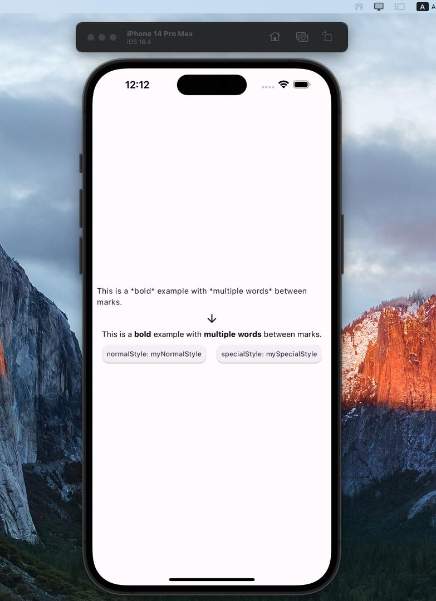

A Flutter package for easy text formatting with customizable styles between specified marks.

## Features



## Usage

```dart
import 'package:special_text_between_marks/special_text_between_marks.dart';

SpecialTextBetweenMarks(
                  text:
                      'This is the *Custom* example with *multiple words* between marks.',
                  openMark: '*',
                  closeMark: '*',
                  normalStyle: myNormalStyle,
                  specialStyle: mySpecialStyle,
                ),
                
```
